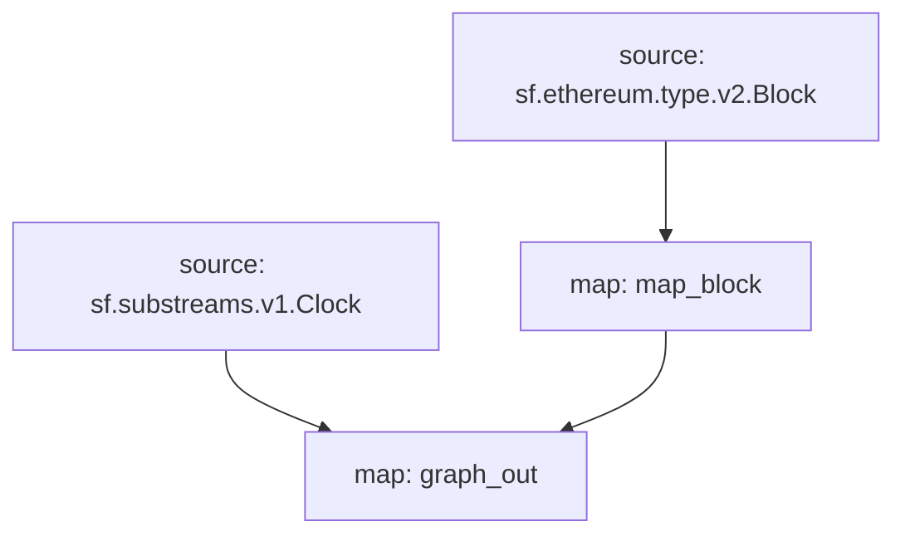

# ERC-20 Substreams

> Substreams for ERC-20 tokens.

## Quickstart

```
$ gh repo clone pinax-network/substreams-erc20
$ cd substreams-erc20
$ make
$ make gui
```

## Releases

- https://github.com/pinax-network/substreams-erc20/releases

## References
- [Ethereum Docs: ERC-20 Token Standard](https://ethereum.org/en/developers/docs/standards/tokens/erc-20/)
- [EIPS: ERC-20 Token Standard ](https://eips.ethereum.org/EIPS/eip-20)
- [OpenZeppelin implementation](https://github.com/OpenZeppelin/openzeppelin-contracts/blob/9b3710465583284b8c4c5d2245749246bb2e0094/contracts/token/ERC20/ERC20.sol)
- [ConsenSys implementation](https://github.com/ConsenSys/Tokens/blob/fdf687c69d998266a95f15216b1955a4965a0a6d/contracts/eip20/EIP20.sol)

### Methods

| Method | Description |
|--------|-------------|
| [`name`](https://eips.ethereum.org/EIPS/eip-20#name) | Returns the name of the token - e.g. "MyToken".
| [`symbol`](https://eips.ethereum.org/EIPS/eip-20#symbol) | Returns the symbol of the token. E.g. "HIX". |
| [`decimals`](https://eips.ethereum.org/EIPS/eip-20#decimals) | Returns the number of decimals the token uses - e.g. `8`, means to divide the token amount by `100000000` to  |get its user representation.
| [`totalSupply`](https://eips.ethereum.org/EIPS/eip-20#totalSupply) | Returns the total token supply. |
| [`balanceOf`](https://eips.ethereum.org/EIPS/eip-20#balanceof) | Returns the account balance of another account with address `_owner`. |
| [`transfer`](https://eips.ethereum.org/EIPS/eip-20#transfer) | Transfers _value amount of tokens to address `_to`, and MUST fire the `Transfer` event. |
| [`transferFrom`](https://eips.ethereum.org/EIPS/eip-20#transferFrom) | Transfers _value amount of tokens from address `_from` to address `_to`, and MUST fire the `Transfer` event. |
| [`approve`](https://eips.ethereum.org/EIPS/eip-20#approve) | Allows `_spender` to withdraw from your account multiple times, up to the `_value` amount. If this function is  |called again it overwrites the current allowance with `_value`.
| [`allowance`](https://eips.ethereum.org/EIPS/eip-20#allowance) | Returns the amount which `_spender` is still allowed to withdraw from `_owner`. |

### Inputs `ERC20`

| input         | method                               |
|---------------|--------------------------------------|
| `0xa9059cbb`  | `transfer(address,uint256)`
| `0x23b872dd`  | `transferFrom(address,address,uint256)`
| `0x095ea7b3`  | `approve(address,uint256)`

### Inputs `Tether USDT`

> https://etherscan.io/token/0xdac17f958d2ee523a2206206994597c13d831ec7#writeContract


| input         | method                               |
|---------------|--------------------------------------|
| `0xcc872b66`  | `issue(uint256)`
| `0xdb006a75`  | `redeem(uint256)`

### Inputs `Circle UDSC`

> https://etherscan.io/address/0xa0b86991c6218b36c1d19d4a2e9eb0ce3606eb48#writeProxyContract

| input         | method                               |
|---------------|--------------------------------------|
| `0x40c10f19`  | `mint(address,uint256)`
| `0x42966c68`  | `burn(uint256)`
| `0xf2fde38b`  | `transferOwnership(address)`

### Events

| Event  | Description |
|--------|-------------|
| [`Transfer`](https://eips.ethereum.org/EIPS/eip-20#transfer-1) | MUST trigger when tokens are transferred, including zero value transfers. |
| [`Approval`](https://eips.ethereum.org/EIPS/eip-20#approval) | MUST trigger on any successful call to `approve(address _spender, uint256 _value)`. |

### Mermaid Graph



Here is a quick link to see the graph:

https://mermaid.live/edit#pako:eJx0j0FqAzEMRa9itJ6YtN25uzY3aHd1CIqtZEKj2NhSIIS5e8EDM22ZLL_-5z10h5AigYNjwdybz82rvxjDmHf7cwrfX4zZzXHb2nqwJD0VUrZyy2Svz_atrWvSEsg9XmzNauV1vX6hGdqYTb9LKqNxipOx6r5KIeRqr0_2_b9uof7lmnB_v1seQAdMhfEUwcHdg_TE5MF5iHRAPYuHATpAlfRxuwRwUpQ60BxRaHPCY0Eej8NPAAAA__89CXqq

### Modules

```yaml
Package name: erc20
Version: v0.3.0
Doc: ERC-20
Modules:
----
Name: map_block
Initial block: 0
Kind: map
Output Type: proto:erc20.types.v1.Block
Hash: b12d86d51593789e230c66f0980f23c27b48d431
Doc: Extracts 'Approval' & 'Transfer' events from the block and storage changes from 'transfer' and 'transferFrom' functions.

Name: graph_out
Initial block: 0
Kind: map
Output Type: proto:sf.substreams.sink.entity.v1.EntityChanges
Hash: 9ebb0501883d74139f68af6d24b3649b35f80bb5

Name: kv_out
Initial block: 0
Kind: map
Output Type: proto:sf.substreams.sink.kv.v1.KVOperations
Hash: 18506933a53f78a0c8581d77ccedb2059d3a78f3
```